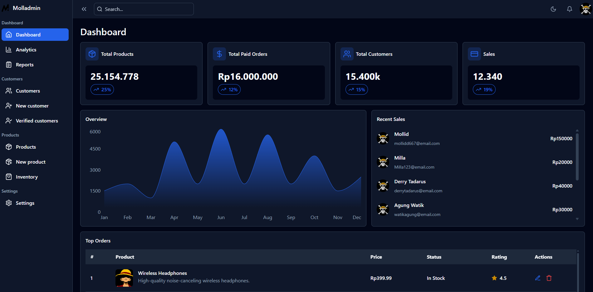

# 🧑‍💻 Mollid Dev | Dashboard V2.1



## 🛠️ Teknologi yang Digunakan

-   [React JS](https://react.dev)
-   [TailwindCSS](https://tailwindcss.com/)
-   [Lucide Icons](https://lucide.dev/)
-   [React Router](https://reactrouter.com/en/main)
-   [Recharts](https://recharts.org/en-US/)

## ✨ Fitur

-   **Desain Responsif:** Memastikan portofolio Anda tampak hebat di desktop, tablet, dan perangkat seluler.
-   **Tata Letak Bersih dan Modern:** Desain profesional yang menyoroti proyek, keterampilan, dan pengalaman Anda.

## 🚀 Getting Started

To get started follow these steps:

#### Cloning the Repository

Using CLI

```bash
git clone 
```

**\*\*_Ensure you have installed [Git](https://git-scm.com) on your machine._**

or using GitHub:

-   Go to the project [repository]() on my GitHub page
-   Click on the green button on the top 👆
-   Click Download ZIP

#### Installation

Install the project dependencies using npm:

```bash
npm install
```

**\*\*_Ensure you have installed [NodeJS](https://nodejs.org/en) on your machine._**

#### Running the Project

```bash
npm run dev
```

**\*\*_This project uses [Vite](https://vitejs.dev)._**
